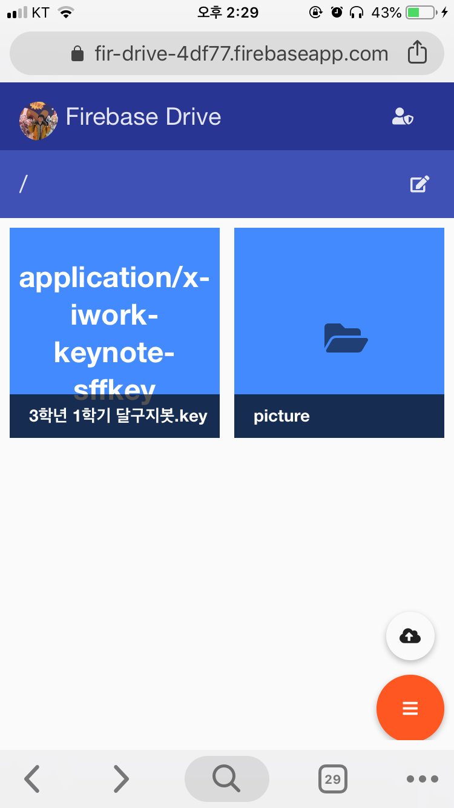
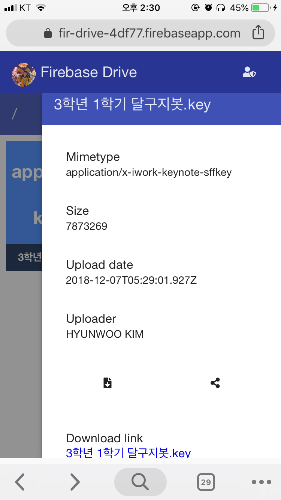

# Firebase-Google-Drive
Use firebase as google drive




## Getting Started

### Prerequisites

#### Back-end

- NodeJS `6.11.5`

npm packages -> `package.json`

```
cd functions
npm i -save <PACKAGE NAME>
```

- set env config
```
firebase functions:config:set someservice.key="THE API KEY"
```

- get env config
```
firebase functions:config:get
```

- export env config
```
firebase functions:config:get > .runtimeconfig.json
```
 
#### Front-end

- AngularJS `1.7.4`

- AngularJS Material `1.1.10`

- Jquery `3.3.1`

## Running the tests

### Back-end

```
firebase serve --only functions
```

### Front-end

Run `public/index.html`

## Deployment

### Back-end

```
firebase deploy --only functions
```

### Front-end

```
firebase deploy --only hosting
```

## Built With

* [Node](https://nodejs.org/en/blog/release/v6.11.5/) - The web framework used

## License

This project is licensed under the MIT License - see the [LICENSE.md](LICENSE) file for details